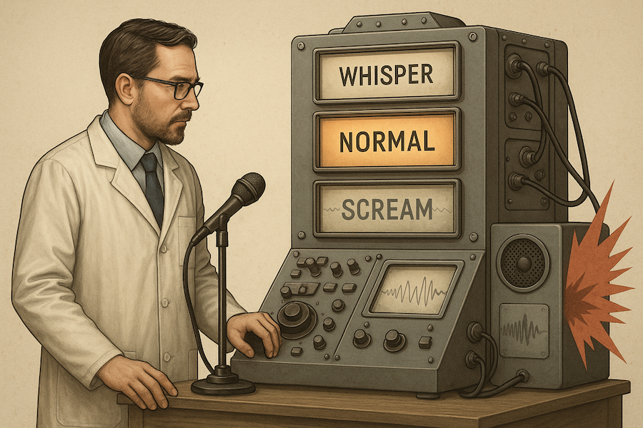

# Reconstructed Audio Classification - Polish AI Olympiad III

This repository is a reconstructed reference solution for the first-stage Audio Classification task in the Polish Artificial Intelligence Olympiad.
It is not the author's original competition submission.

The pipeline converts waveforms to normalized log-spectrogram features and is designed for a compact convolutional classifier with time masking and frequency masking augmentations.
The NumPy feature extractor enables reproducible preprocessing without hidden notebook state.

*Task illustration embedded in the official Polish AI Olympiad III notebook.*

## Quick start

`python -m unittest discover -s tests -v`

## Validation

The smoke test generates a sine wave and confirms a finite, correctly shaped log-spectrogram.
It is a preprocessing check, not an official accuracy score.

## Provenance

The original Polish task notebook is retained as `notebooks/original_submission.ipynb`.
`docs/task_en.md` is an English task summary.
